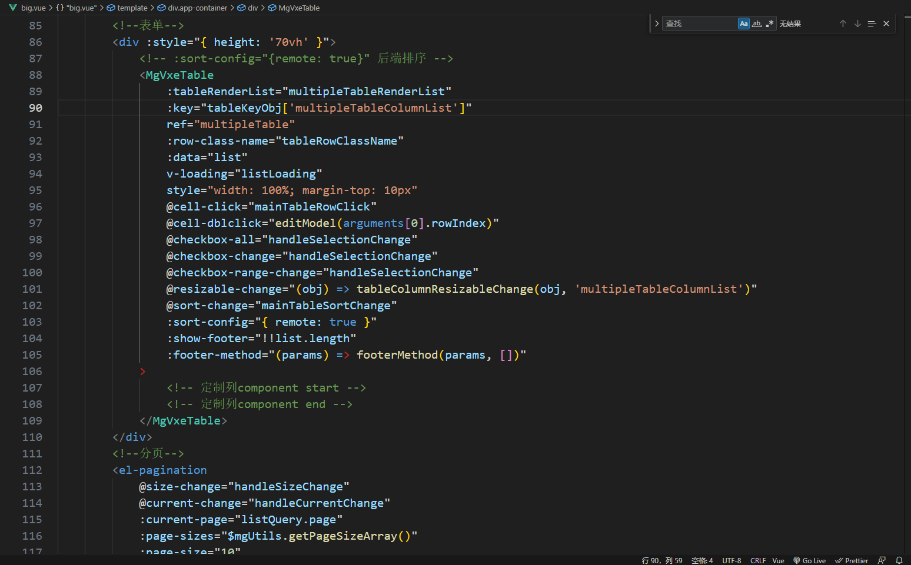
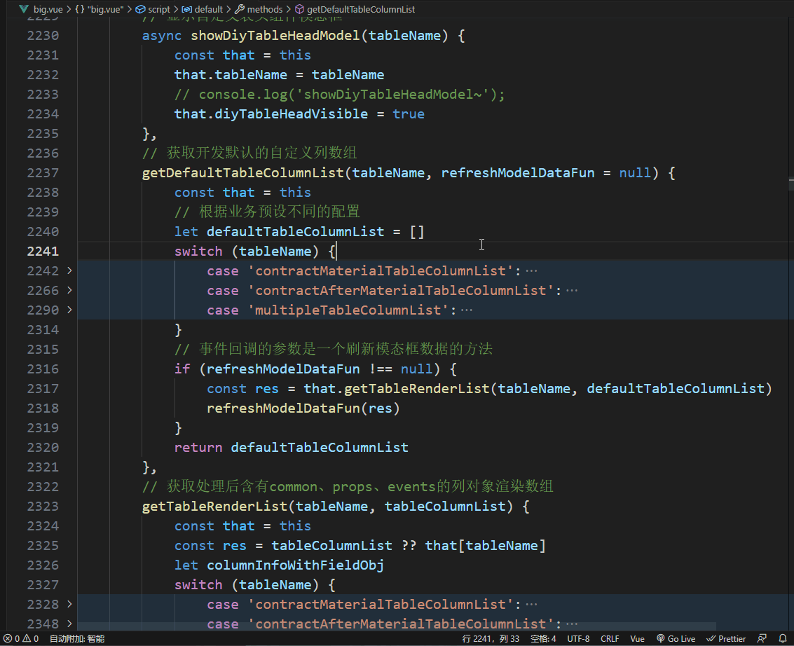

# mg-helper README

针对慧算租PC前端项目的列定制功能开发的插件。

## Features

+ [v0.0.2] F12/Ctrl+左键快捷键跳转到列定制编写行；

  

+ [v0.0.4] 支持在列定制方法中的列定制XXXColumnList字段名上按下F12或Ctrl+左键互相跳转；

  

+ [v0.0.5] 支持在列定制方法中的列定制XXXColumnList中的业务字段上按下F12或Ctrl+左键互相跳转；

  

## Release Notes

### v0.0.2

F12/Ctrl+左键快捷键跳转到列定制编写行；

### v0.0.4

列定制方法名的匹配规则替换为正则表达式匹配，修复方法名判断错误的bug；

**支持在列定制方法中的列定制XXXColumnList字段名上按下F12或Ctrl+左键互相跳转；**

### v0.0.5

**支持在列定制方法中的列定制XXXColumnList中的业务字段上按下F12或Ctrl+左键互相跳转；**
